# Secure-EC2-S3-Integration-using-IAM-Role

Step 1 :
I **CREATED** an Amazon S3 bucket which will be used as cloud storage for this project.
I kept block public access enabled because in real companies storage should be private by default for security reasons.

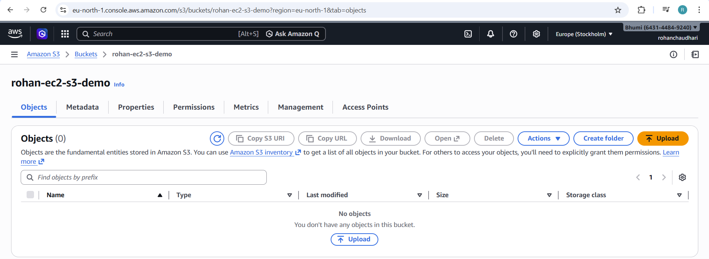

Step 2 :
I **UPLOADED** a sample file inside the S3 bucket.
This file will be used later to test whether EC2 instance can download files from S3 storage.

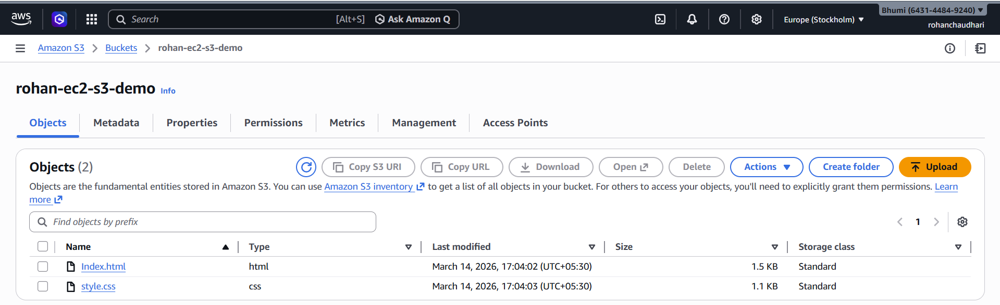

Step 3 :
I **Launched an EC2 instance** which will act like an application server in this project.
This server will later connect with S3 storage securely.

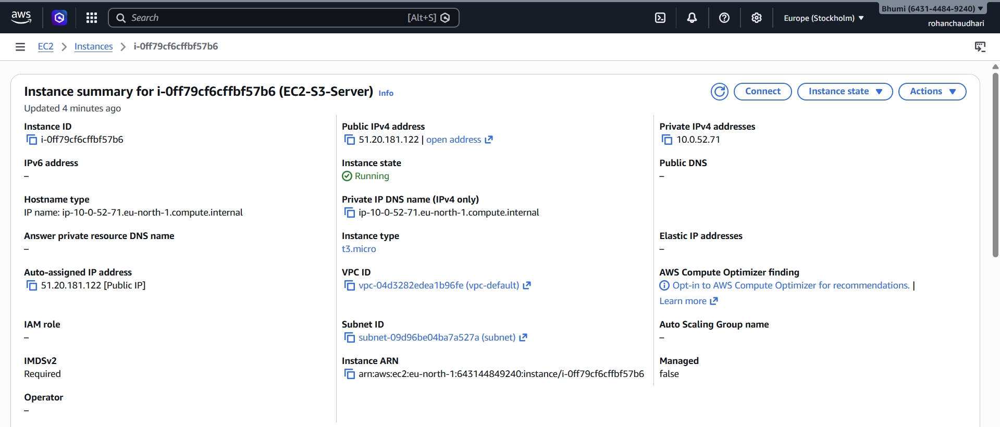

Step 4 :
I **connected** to the **EC2 instance using SSH** from my local machine.
This allows me to configure the server and run commands inside it.

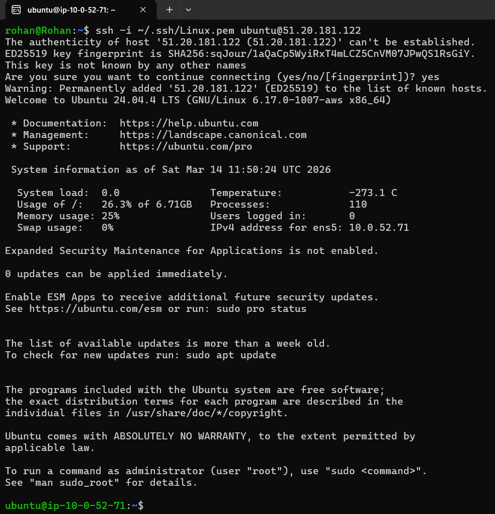

Step 5 :
I installed **AWS CLI** inside the EC2 instance.
This tool is required so that the server can run commands to interact with AWS services like S3.

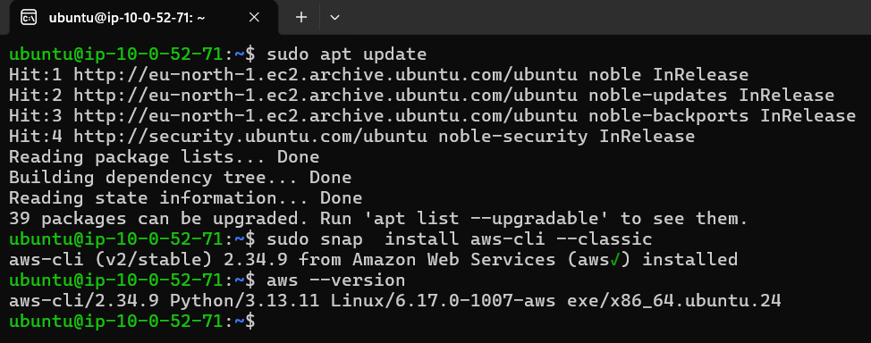

Step 6 :
I tried to list S3 buckets from EC2 but it **Failed** with Access Denied error.
This shows that by default EC2 has no permission to access storage which is good security behaviour.

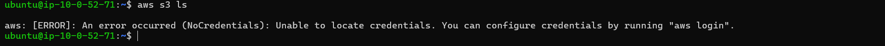

Step 7 :
I created an **IAM role** which will give **S3 access** permission to the **EC2 instance**.
Using role is safer than using access keys because credentials are managed automatically by AWS.

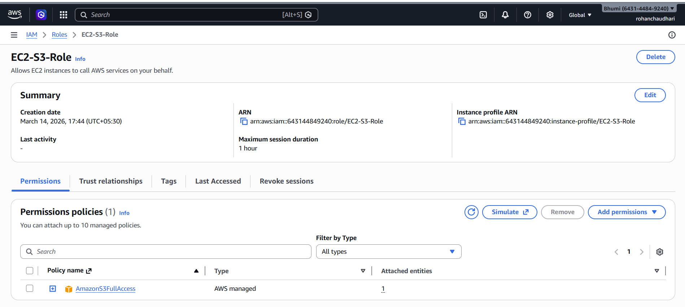

Step 8 :
I **Attached** the IAM role to my EC2 instance so that it can securely communicate with S3 service.

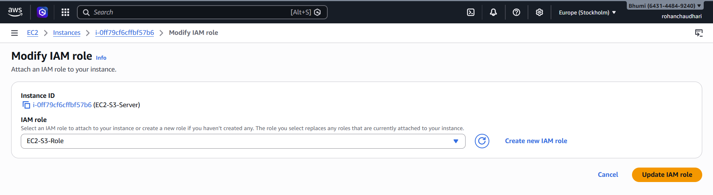

Step 9 :
After attaching the role I **Tested S3 access again** and now the EC2 instance was able to list buckets successfully.

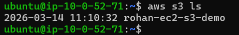

Step 10 :
I **Downloaded** the test file from S3 bucket to the EC2 instance.
This confirms that the server **can read** data from storage.
Reason why we use --recursive :- You will see all objects list

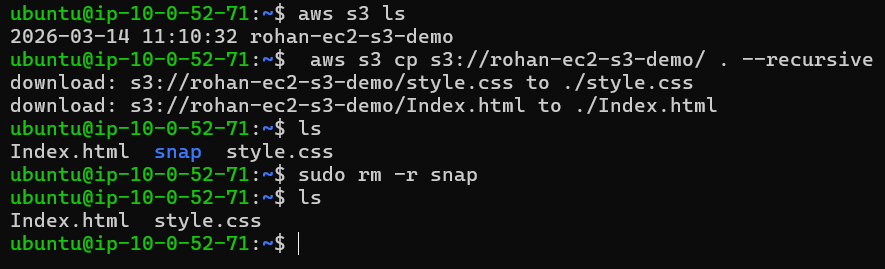

Step 11 :
I created a **New file** inside EC2 and **Uploaded** it to the S3 bucket.
This confirms that the server can write data to storage.

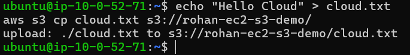

Image show the output that the file is sucessfully uploaded in the S3

.png)

